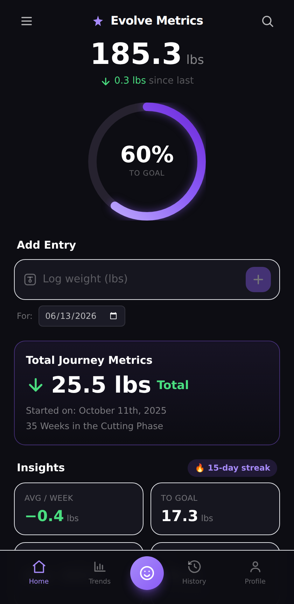

# Evolve Metrics

A polished, mobile-first weight-tracking app built from the original design mockup.
Dark theme, violet accents, animated progress ring, and a live weight-trend chart.



## Features

- **Hero dashboard** — current weight, change since last weigh-in, and an animated
  circular ring showing progress toward your goal.
- **Add Entry** — log your weight in one tap, today or backdated to any past day.
  A new entry replaces an existing one for the same day so your trend stays clean.
- **Insights** — average weekly rate, projected goal date, amount remaining, BMI,
  and a logging streak, all recalculated as you log.
- **Total Journey Metrics** — pounds (or kg) lost since you started and how many
  weeks you've been in your current phase.
- **Weekly Trend** — an interactive area chart (powered by Recharts) with
  1M / 3M / 6M / All range filters and a dashed goal line.
- **All Entries** — full, deletable history with per-entry deltas.
- **Units** — switch between **lbs** and **kg**; every value converts instantly.
- **Profile** — edit start weight, goal weight, height, phase, and start date.
  Everything recalculates immediately.
- **Toasts** — lightweight confirmation feedback on every action.
- **Installable PWA** — add it to your home screen; works offline via a service
  worker and ships with app icons + a web manifest.
- **Local persistence** — entries and profile are saved to `localStorage`, so your
  data survives reloads. Ships with realistic sample data on first run.

## Tech stack

- React 18 + TypeScript
- Vite
- Tailwind CSS
- Recharts
- PWA (web manifest + service worker)

## Getting started

```bash
npm install
npm run dev      # start the dev server (http://localhost:5173)
npm run build    # type-check + production build
npm run preview  # preview the production build
```

## Project structure

```
src/
  components/      UI sections (Header, ProgressRing, AddEntry, Insights,
                   WeeklyTrend, JourneyMetrics, EntriesList, BottomNav, Toasts)
  metrics.ts       pure calculations (progress, totals, rate, projection, BMI, streak)
  storage.ts       localStorage-backed hooks + sample data (UTC-safe dates)
  units.ts         lbs <-> kg conversion helpers
  types.ts         shared types
  icons.tsx        inline SVG icon set
  App.tsx          screen layout, tabs, toasts, and the phone frame
public/
  manifest.webmanifest, sw.js, icons   PWA assets
```
